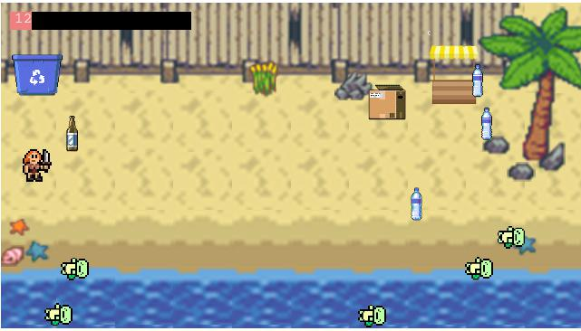

# Conservation Game

**Team Members:** Regina, Huai Kang, Shawn, Yanjun, Kevan

Repository for the game created for the Engineering System Architecture (ESA) module in Term 5. For this class, we were tasked to build a physical or digital game. In order to do so, we had to use the system design tools that we learnt in class: influence diagrams, use cases & scenarios, design rules etc. The system definition document can be found [here](https://github.com/tankevan/Team22ESA). 

[You can play the game here!](https://huai-bao.herokuapp.com).

A video introducing the features of the game can be found on .

## Technologies Used

The game was created using the Phaser.js library and hosted on Heroku and serves the `index.html` page with a node package called `http-server`. 

## Game Mechanics
The goal of this game was to promote environmental awareness in schools. By getting students to engage with the idea of cleaning up beaches, "saving" animals, we hoped to get them interested in the idea of volunteering to pick up litter at actual beaches.

The game was inspired by the mechanics of a game called Diner Dash. We chose to model our game after that because it makes it easy to add new tasks that the player can perform, which can change with the game location as well. For example, instead of a beach, the game could be based in a shopping mall and the tasks there would be to pick up litter on the floor, or help to clean up spilled drinks etc. 

One cool mechanic implemented that mimics Diner Dash is the ability to queue actions. Whenever a user clicks on a game object, the x and y coordinates are stored in a queue and the character performs these actions one after another seamlessly. Users can also dequeue an action by clicking on the game object again. This allows the user to focus on planning the most efficient path of action instead of having to wait for the character to finish each action before moving on. 

#### Picking Trash
Users can get points by picking up trash on the beach - clicking on the trash, then clicking on the recycling bin. Each item picked only adds to your "life" when it is placed in the recycling bin.

#### Saving Animals
Users can choose to "save" animals as well. After arriving at the animal, the character takes several seconds before the animal is "saved". Depending on the positioning of the trash and animals, it might be more efficient to pick up trash (if they're placed closed to the bin) or save the animals (if the animals are clumped together).

#### Convincing Others
Both of the previous actions are for the sake of buying time so that the user can go to the convincing booth in the top right corner; to advocate for more volunteers to help out. After the bar at the booth reaches 100, an automatically controlled character joins the fray, making things much more manageable. Many hands make light work so why don't you try volunteering to clean up your local beach?